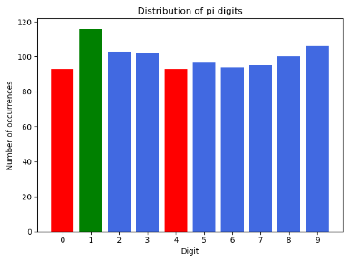

# Distribution of digits of the decimal places of Pi
### Example
The following plot is the distribution for 1000 decimal places:

The green color indicates the highest number of occurrences, the red color the lowest.

Inspired by [r/dataisbeautiful](https://www.reddit.com/r/dataisbeautiful/)